Hello. My name is Tetiana.

I  want to thank you for this course. 

Before, I started to study something in frontend, but it was not systematic. And as a result, I did not get extensive knowledge. 

Now I hope to get knowledge step by step
***

# ***Stage 0. Self-Study***
## **General**
- [X] Git and GitHub
- [X] Linux CLI, and HTTP
- [X] Git Collaboration
## **Front-End Basics**
- [X] Intro to HTML & CSS
- [ ] Responsive Web Design
- [ ] HTML & CSS Practice
- [ ] JavaScript Basics
- [ ] Document Object Model - practice
  

 ## **Advanced Topics**
- [ ] Building a Tiny JS World (pre-OOP) - practice
- [ ] Object oriented JS - practice
- [ ] OOP exercise - practice
- [ ] Offline Web Applications - optional
- [ ] Memory pair game — real project!
- [ ] Website Performance Optimization - optional
- [ ] Friends App - real project!
***
## **0. Git and GitHub**
I liked information about git - it was difficult, but interesting. In the future, I want to understand more and apply it in practice.

### ***1. [Introduction to Git and GitHub (1week_and_2week)](https://www.coursera.org/learn/introduction-git-github)***
 

  
Screenshot

  
  

### ***2. [learngitbranching.js.org](https://learngitbranching.js.org/?locale=en_US)***

 

  
Screenshot

  
   

***

 ## **1. Linux CLI, and HTTP**
It was my first introduction to Linux operating system. The information was interesting. I got to know the basic Linux commands. The interactive form made it easy to remember them

 ### ***1. [Linux Survival (4 modules)](https://linuxsurvival.com/linux-tutorial-introduction/)***
 
   

  
Screenshot

  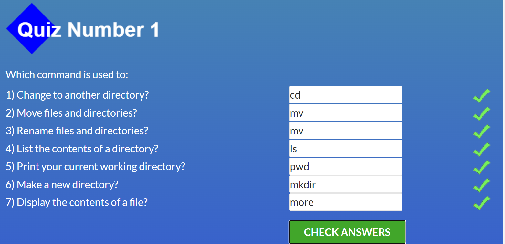
  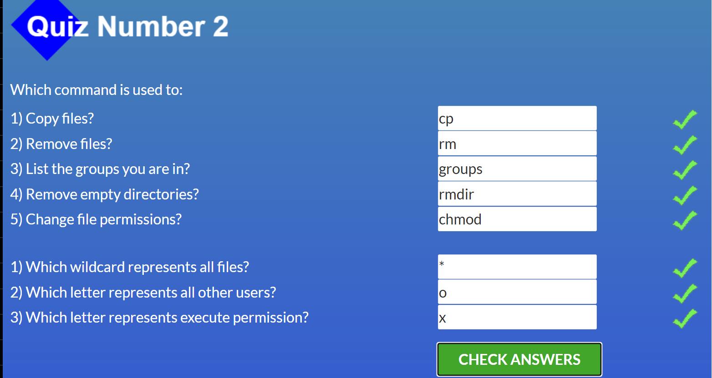
  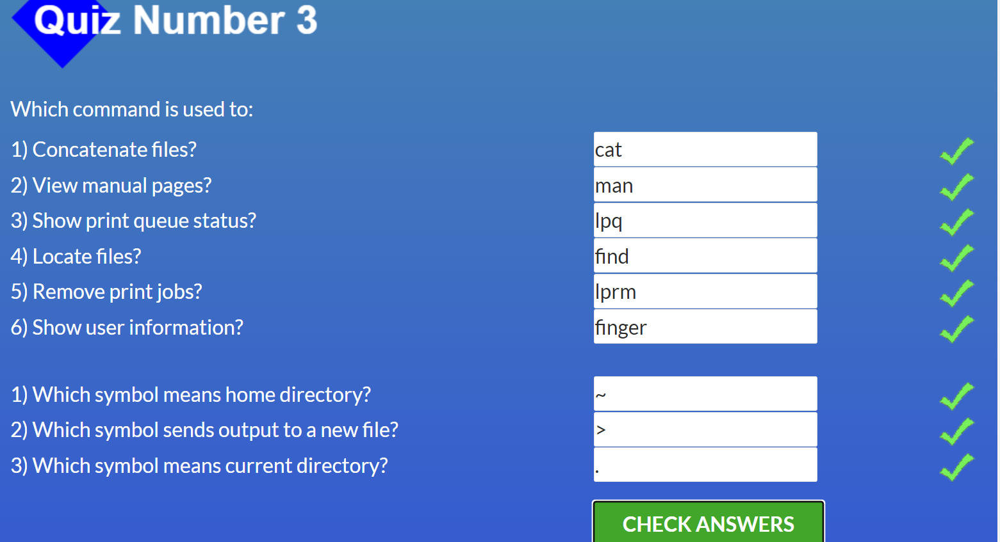
  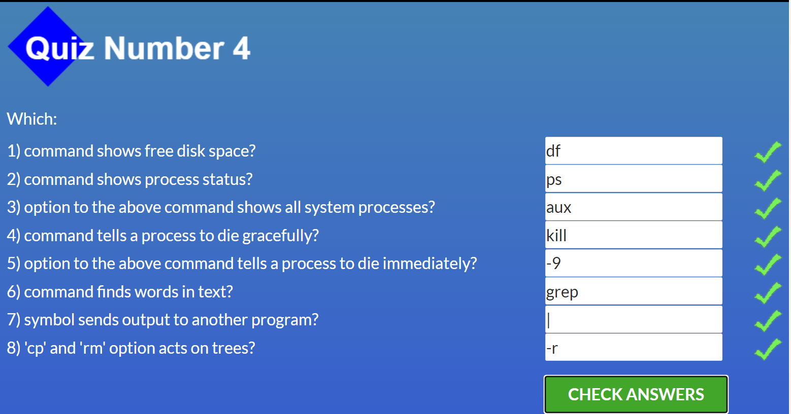

 #### ***2. [HTTP: Протокол, який повинен розуміти кожний веб-розробник - Частина 1](https://code.tutsplus.com/uk/tutorials/http-the-protocol-every-web-developer-must-know-part-1--net-31177)***
  
#### ***3. [HTTP: Протокол, який повинен розуміти кожний веб-розробник - Частина 2](https://code.tutsplus.com/uk/tutorials/http-the-protocol-every-web-developer-must-know-part-2--net-31155)***

As for me, HTTP is quite difficult topic to understand, but very important. I learned a lot of HyperText Transfer Protocol, but I want to come back to this topic later
***
## **2. Git Collaboration**
Before, I didn't use GitHub. It seemed a complicated web service. 

However, the lessons helped to understand in more detail and remember enough commands to interact with GitHub.

I will use this web service in the future. Since, it opens up wide possibilities

### ***1. [Introduction to Git and GitHub (3week_and_4week)](https://www.coursera.org/learn/introduction-git-github)***

  
Screenshot

  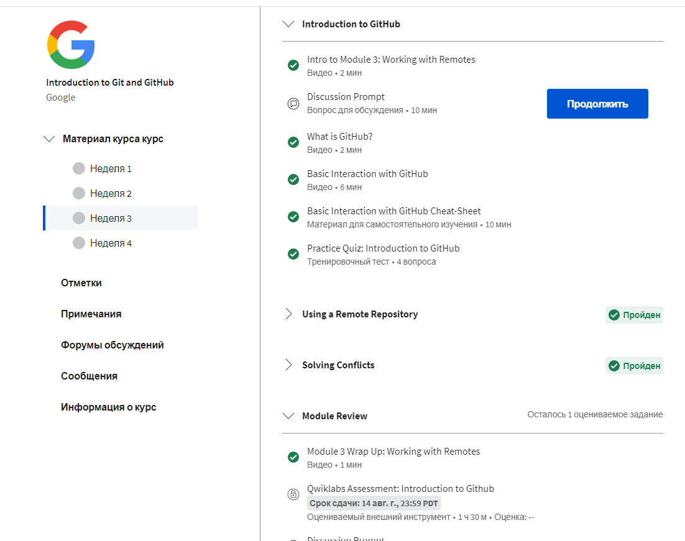
   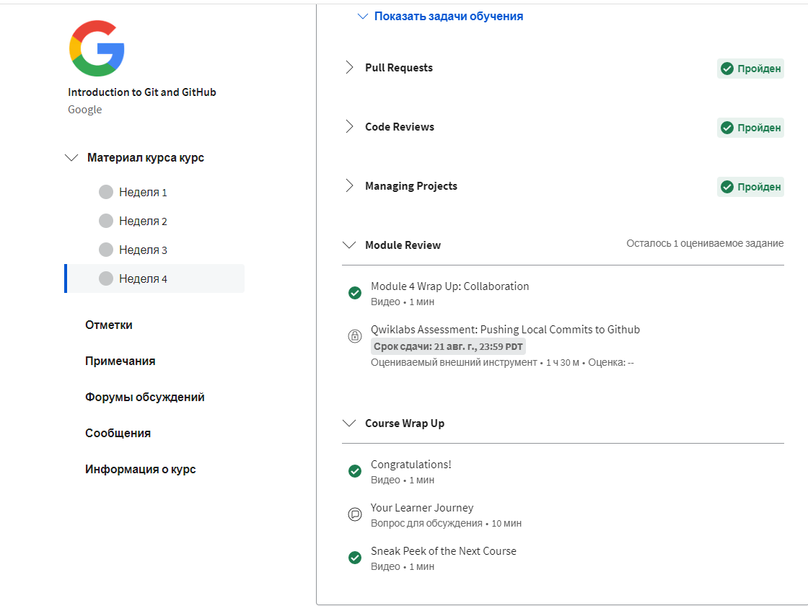

### ***2. [learngitbranching.js.org](https://learngitbranching.js.org/?locale=en_US)***

 

  
Screenshot

  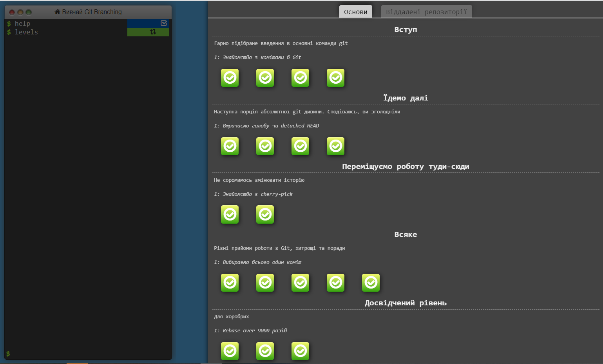
   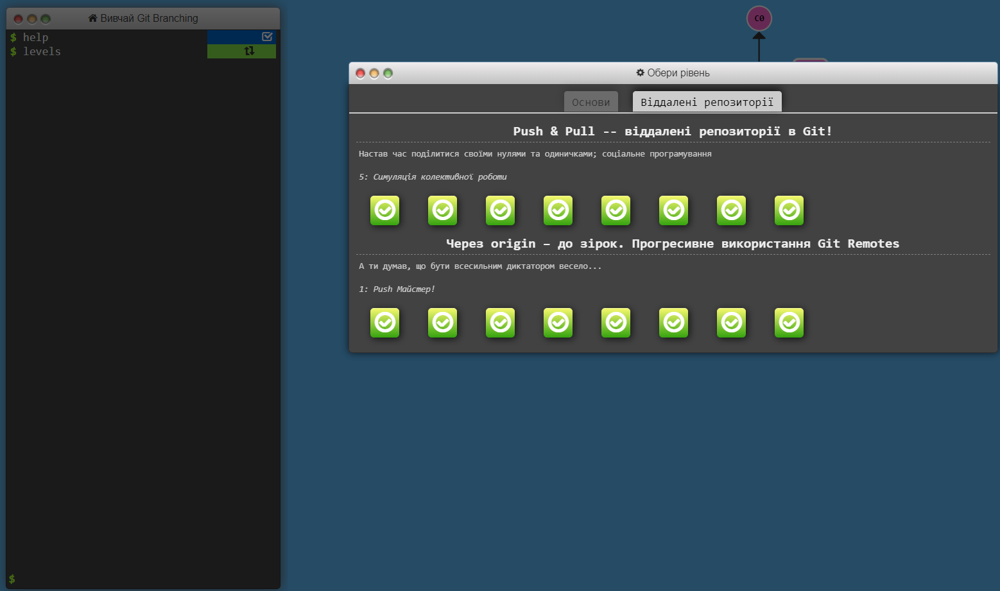

***

## **3. Intro to HTML and CSS**
I already knew a bit about HTML and CSS. However, it was useful to refresh knowledge.

I enjoyed the lessons on Codecademy. I was surprised why I didn't find these lessons earlier. Combining theory with practice is great.

I will certainly use HTML and CSS in the future.
### ***1. [Intro to HTML & CSS (1week_and_2week)](https://www.coursera.org/learn/html-css-javascript-for-web-developers)***

  
Screenshot

  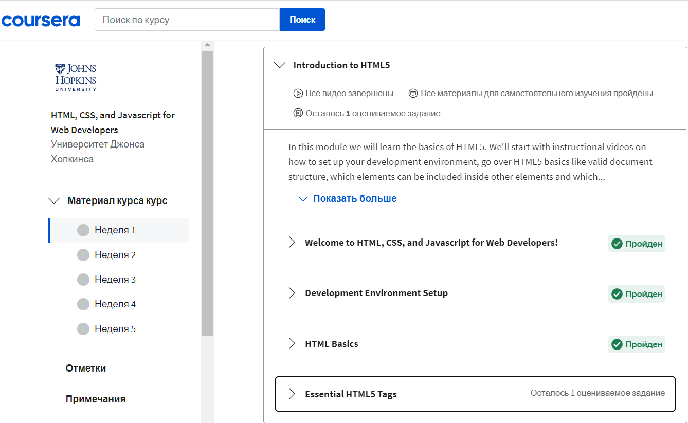
  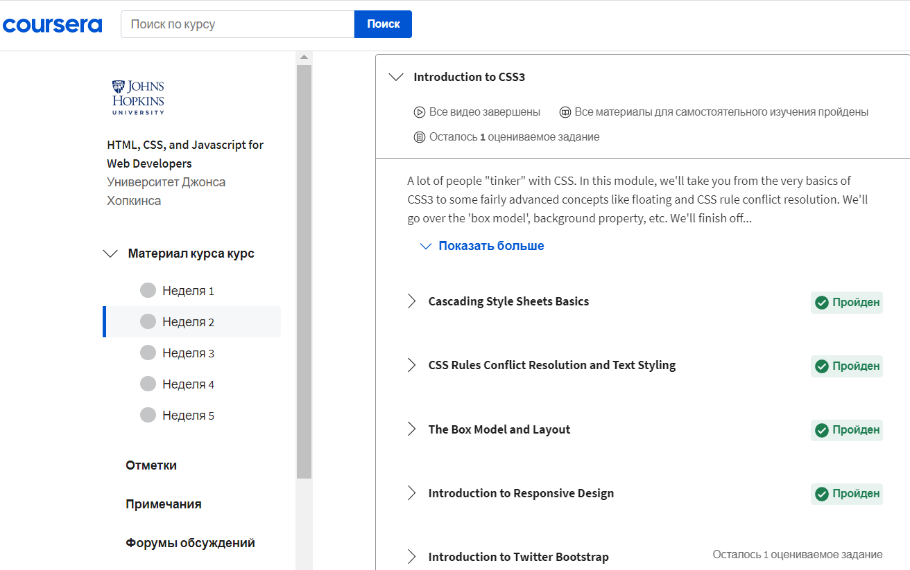

### ***2. [Learn HTML(Eng)](https://www.codecademy.com/learn/learn-html)***
### ***3. [Learn CSS(Eng)](https://www.codecademy.com/learn/learn-css)***

  
Screenshot

  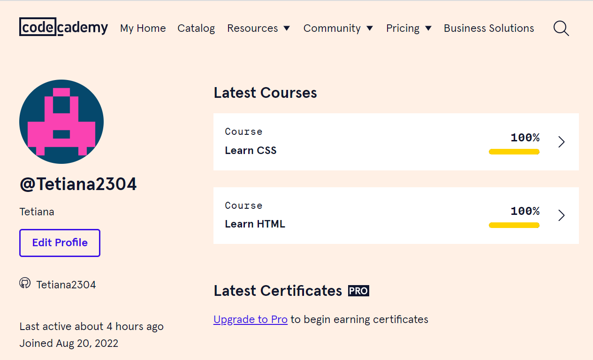

