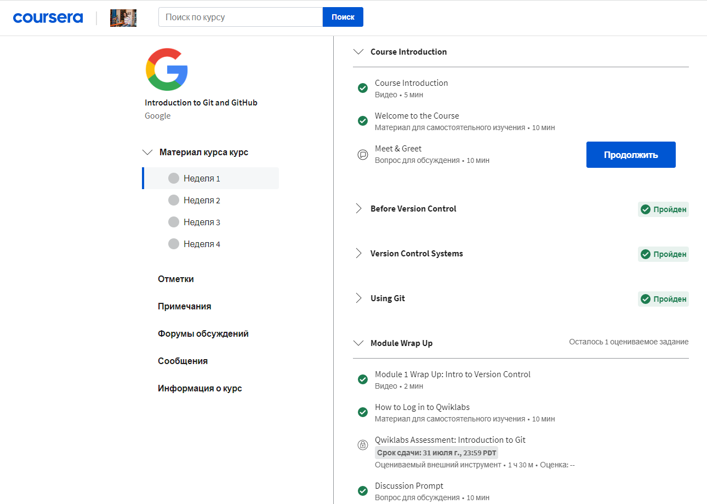
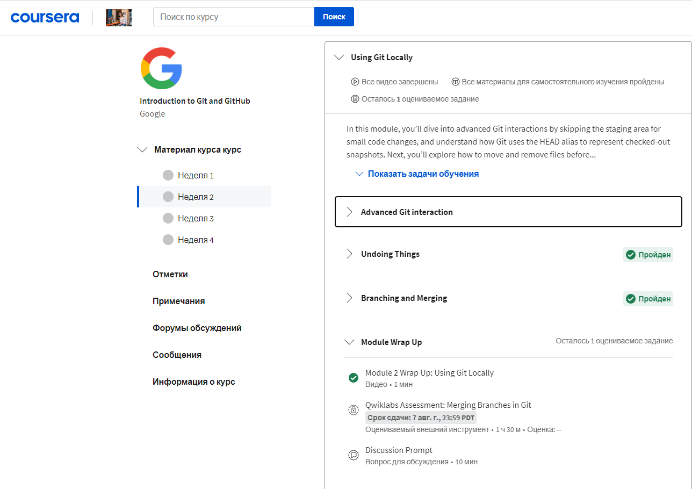
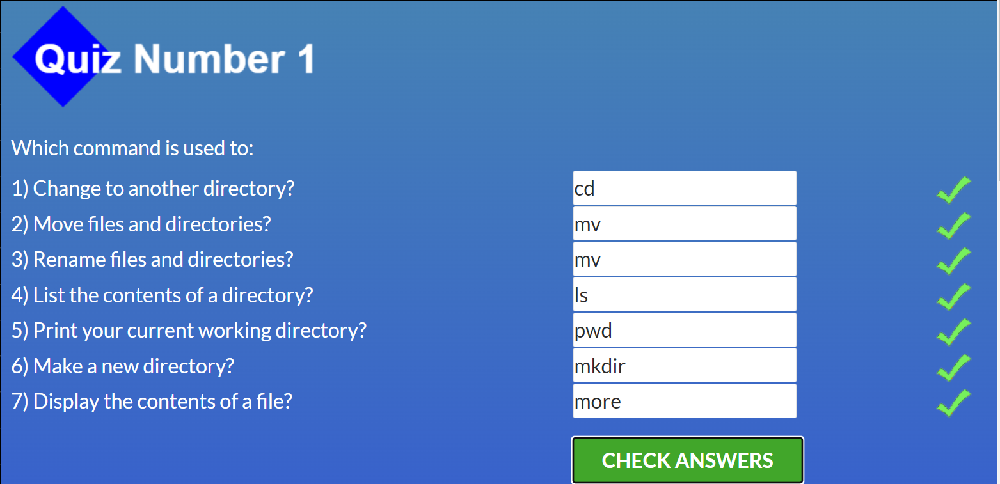
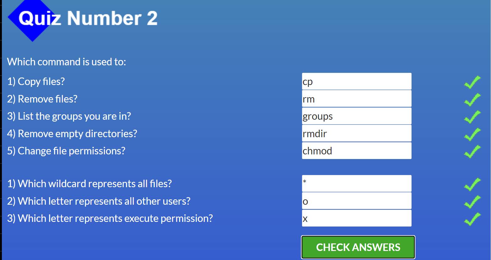
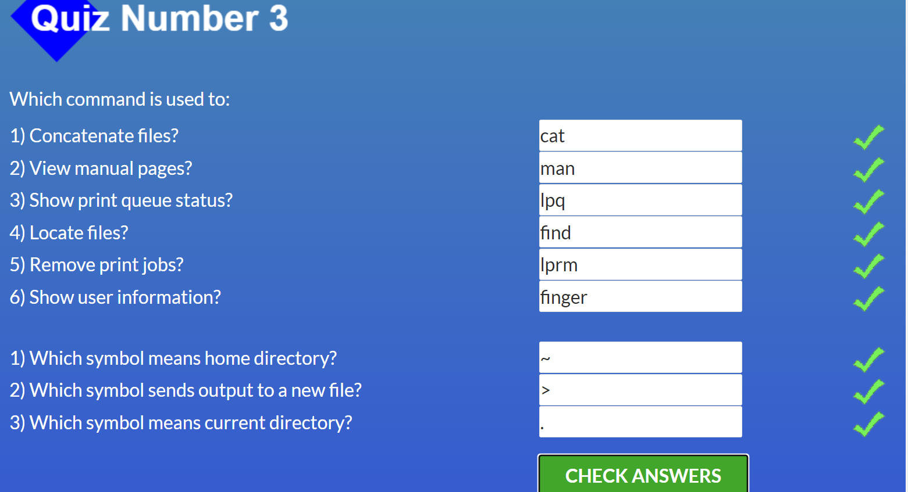
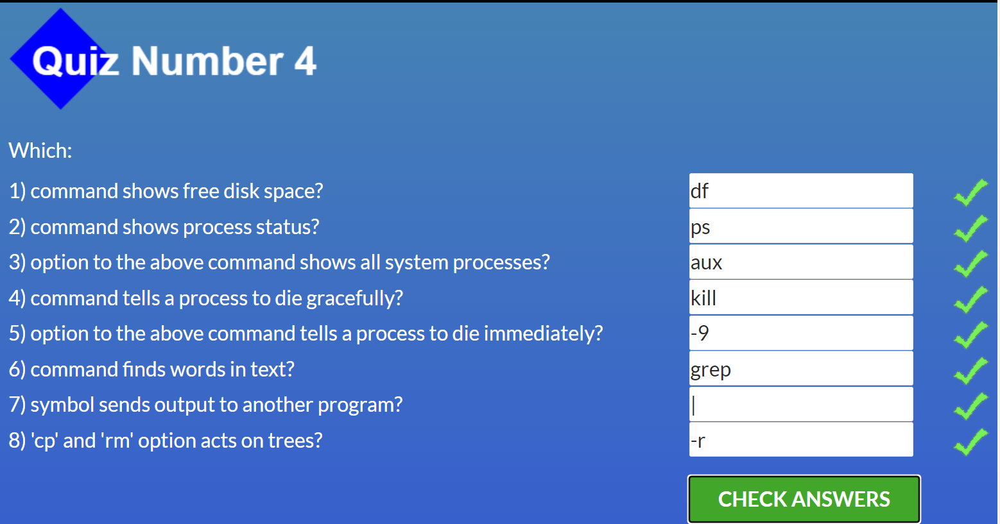

Hello. My name is Tetiana.

I  want to thank you for this course. 

Before, I started to study something in frontend, but it was not systematic. And as a result, I did not get extensive knowledge. 

Now I hope to get knowledge step by step.
***

# ***Stage 0. Self-Study***
## **General**
- [X] 0. Git Basics
- [X] Linux CLI and HTTP
- [ ] GitHub and Collaboration
## **Front-End Basics**
- [ ] Intro to HTML & CSS
- [ ] Responsive Web Design
- [ ] HTML & CSS Practice
- [ ] JavaScript Basics
- [ ] Document Object Model - practice
***
## **0. Git Basics**
I liked information about git - it was difficult, but interesting. In future, I want to understand more and apply it in practice.

### 1. ***Introduction to Git and GitHub***
 

  
Screenshot

  
  

  
### 2.***learngitbranching.js.org:***

 

  
Screenshot

  
   

***

 ## **1. Linux and HTTP**
It was my first introduction to Linux operating system. The information was interesting. I got to know the basic Linux commands. The interactive form made it easy to remember them
 ### 1.***Linux Survival (4 modules)***
 
   

  
Screenshot

  
  
  
  

 ### ***2. [HTTP: Протокол, який повинен розуміти кожний веб-розробник - Частина 1](https://code.tutsplus.com/uk/tutorials/http-the-protocol-every-web-developer-must-know-part-1--net-31177)***
  
### ***3.[HTTP: Протокол, який повинен розуміти кожний веб-розробник - Частина 2](https://code.tutsplus.com/uk/tutorials/http-the-protocol-every-web-developer-must-know-part-2--net-31155)***

As for me, HTTP is quite difficult topic to understand, but very important. I learned a lot of HyperText Transfer Protocol, but I want to come back to this topic later